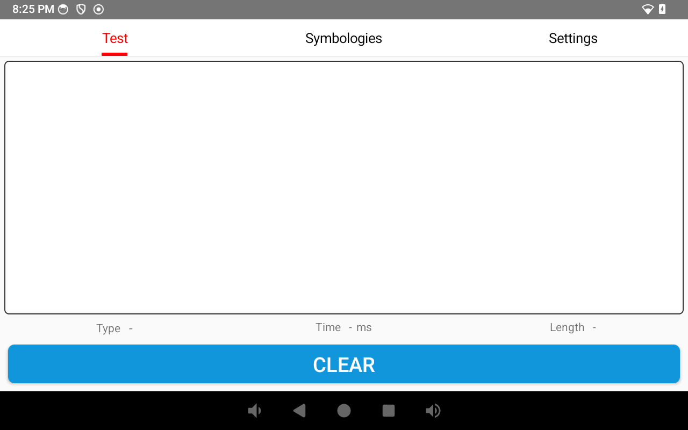
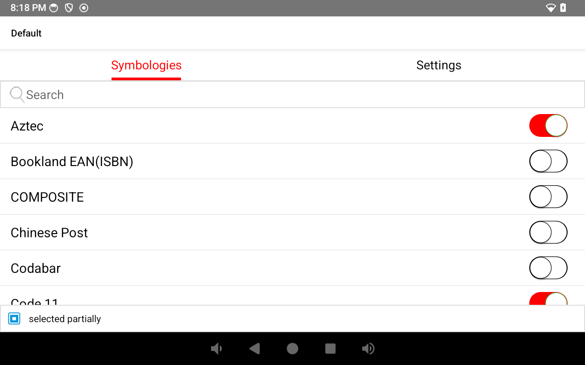
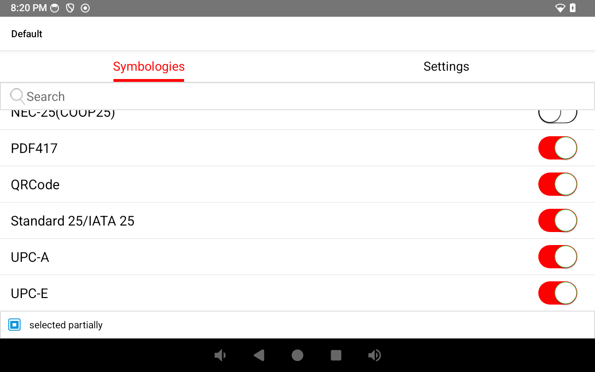
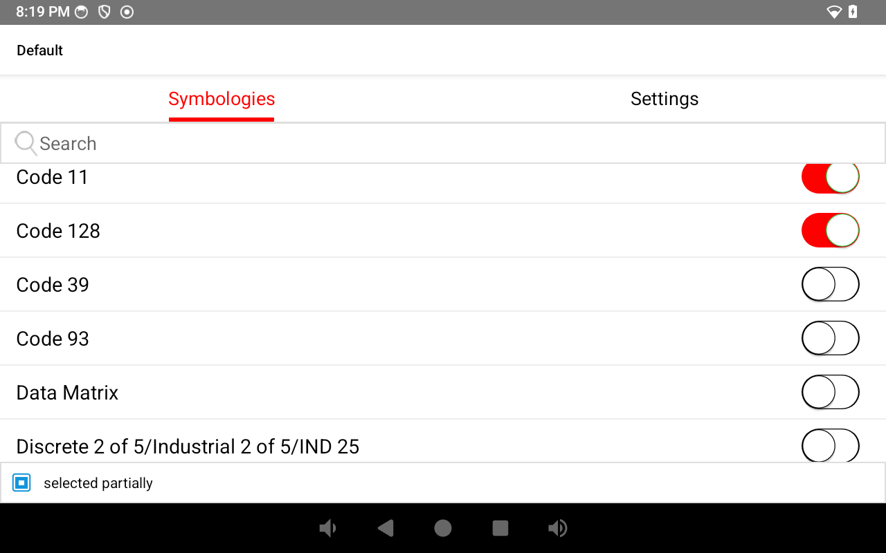
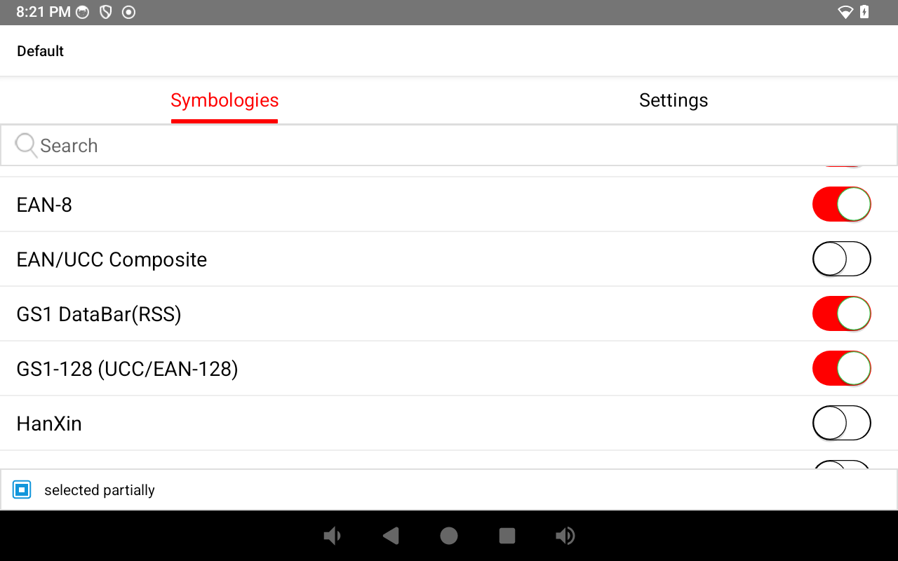
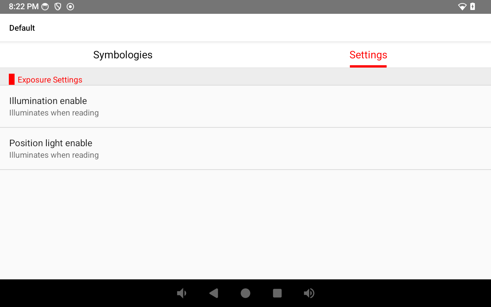
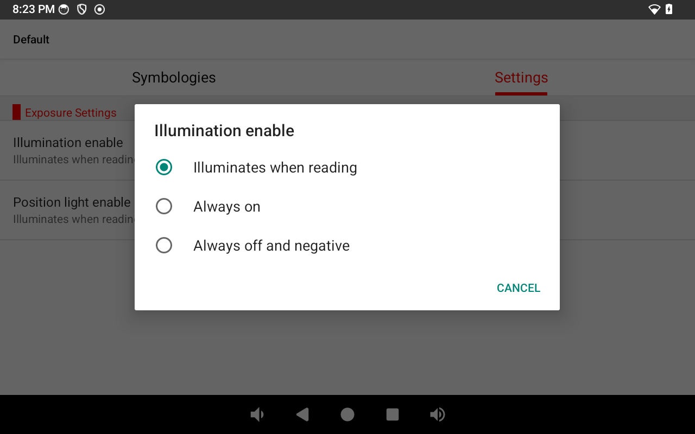
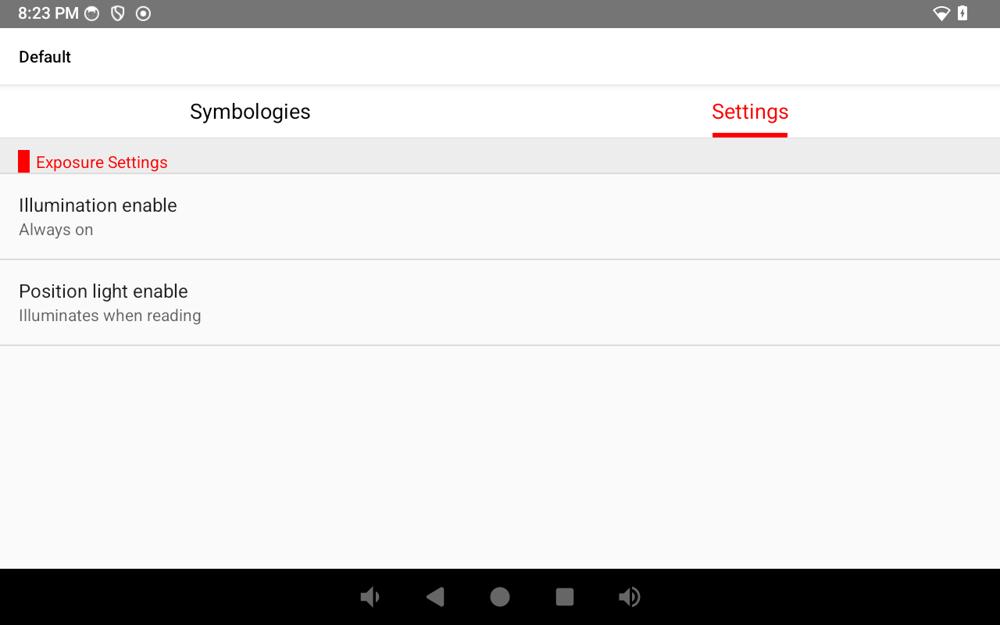

# Manual: configurar o MeWedge no MC45 pra leitura mais rápida

Este manual ensina a repetir, em qualquer MC45 (MEFERI), o ajuste que
reduziu o tempo de leitura de código de barras de **~5 segundos** pra
**~1 segundo** em média — aplicado e testado ao vivo em
`DER4BT125115002178` (2026-10-08). Ver o diagnóstico completo em
`DIAGNOSTICO_E_FIX_LEITURA_LENTA_MC45_SE4070.md`.

**Importante**: isso é configuração de HARDWARE do leitor, feita
diretamente no app `MeWedge` (nativo da MEFERI). Não é algo que o
painel do ARGOS Remote consegue aplicar remotamente — precisa repetir
esse passo a passo em cada aparelho, com o aparelho em mãos.

## Antes de começar

Se o MC45 estiver com o Kiosk ativo (travado no MPlayer), o app
MeWedge não vai conseguir abrir. Desative o Kiosk desse aparelho pelo
painel do ARGOS Remote antes de começar (aba do dispositivo → Kiosk →
Desativar), e reative no final.

## Passo 1 — Abrir o MeWedge

Abra o app **MeWedge** no aparelho (ícone próprio, ou via gaveta de
apps). Ele abre direto numa tela com 3 abas: **Test**, **Symbologies**
e **Settings**.

## Passo 2 — Aba Symbologies: desabilitar o que não usamos

Toque em **Symbologies**. Essa tela lista todos os tipos de código de
barras que o leitor tenta reconhecer. Quanto mais tipos habilitados
(interruptor vermelho/ligado), mais tempo o leitor gasta testando a
imagem contra cada um — isso é a maior causa da demora.

**Deixe HABILITADOS só estes 7** (são os únicos usados em código de
produto de varejo/supermercado):

| Symbology | Por quê |
|---|---|
| EAN-13 | Padrão principal de produtos no Brasil |
| EAN-8 | Produtos pequenos |
| UPC-A | Produtos importados |
| UPC-E | Versão compacta do UPC-A |
| Code 128 | Etiquetas internas/balança |
| GS1-128 (UCC/EAN-128) | Produtos de peso variável (frios, embutidos) |
| GS1 DataBar(RSS) | Produtos de peso variável (hortifruti) |

**Desabilite todos os outros** — role a lista inteira (ela é longa,
em ordem alfabética) e toque no interruptor de cada um destes pra
apagar (branco/desligado):

- Aztec
- Code 11
- Code 39
- Code 93
- Data Matrix
- Interleaved 2 of 5/ITF/Cross 25 Code
- PDF417
- QRCode
- Standard 25/IATA 25

Os demais da lista (Bookland EAN, COMPOSITE, Chinese Post, Codabar,
Discrete 2 of 5, EAN/UCC Composite, HanXin, ISSN, MSI/MSI PLESSEY,
Matrix 25, MaxiCode, NEC-25) já vêm desligados de fábrica — não precisa
mexer neles, só confirmar que continuam desligados.

Cada toque já salva sozinho — não tem botão "Salvar" nessa tela.

## Passo 3 — Aba Settings: deixar a iluminação sempre ligada

Volte e toque em **Settings**. Em **Input Settings**, toque em
**Reader params**.

Dentro de Reader params, em **Exposure Settings**, toque em
**Illumination enable**. Vai abrir um diálogo com 3 opções:

Troque de **"Illuminates when reading"** (padrão de fábrica) pra
**"Always on"**. A luz do leitor fica acesa o tempo todo — isso evita
que o leitor precise "reajustar" a exposição toda vez que tenta ler,
que era parte da demora.

Deixe **"Position light enable"** como estava (não precisou mexer
nesse teste).

## Passo 4 — Testar

Volte pra aba **Test** (pode precisar fechar e reabrir o app pra essa
aba aparecer de novo — feche com o botão Voltar até sair do app, e
abra de novo). Aponte o leitor pra alguns produtos. O campo **Time**
(ms) aparece depois de cada leitura — compare com o que via antes.

Se quiser confirmar no uso real, feche o MeWedge e teste direto no
MPlayer (reative o Kiosk se tiver desativado no início).

## Resumo rápido (pra quem já conhece o processo)

1. MeWedge → Symbologies → manter só EAN-13, EAN-8, UPC-A, UPC-E,
   Code 128, GS1-128, GS1 DataBar(RSS); desligar Aztec, Code 11, Code
   39, Code 93, Data Matrix, Interleaved 2 of 5/ITF, PDF417, QRCode,
   Standard 25/IATA 25.
2. MeWedge → Settings → Reader params → Exposure Settings →
   Illumination enable → **Always on**.
3. Testar.

Resultado esperado: tempo médio de leitura cai de ~5s pra ~1s.
